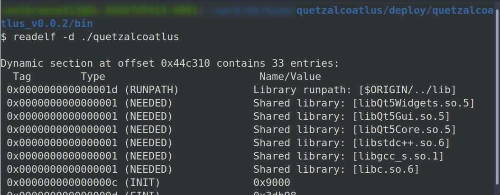

# quetzalcoatlus

 


A Qt-based 'proving-grounds' application to exercise interesting or re-usable parts of Qt, C++17, C++ build strategies (CMake/Makefile), deployment strategies on multiple platforms, including the Docker approach for cross-compilation.

This application is an attempt to preserve the random bits and pieces of advice collected over multiple projects into a (hopefully) cohesive project.

```
ADD MORE!
```


## Usage


### Platforms

Tested on Ubuntu 20.04 with:
- default `apt` provided `Qt 5.12.8`
- Qt Installer provided `Qt 5.15.2` ( base install path used: `/home/${USER}/qt` ==>> so, `5.15.2` path: `/home/${USER}/qt/5.15.2/gcc_64/` )


### Build

If the Qt Version is changed, using `CMAKE_PREFIX_PATH` we are mostly trying to use a separate non-distro-provided installation of Qt, using a Qt Installer.
Recommended to use a base path like: `/home/${USER}/qt` for installation.

In this case, there are 2 things to do:

1. Add the below line in `CMakeLists.txt`, and set path according to the installation on the system:

   ```cmake
   list(PREPEND CMAKE_PREFIX_PATH "<path/to/parent/of/Qt/bin/and/lib>")
   ```

2. Ensure that we remove the CMake `build` directory to clear the cache and any artifact first:
   
   ```bash
   make distclean
   ```

and then build as usual:

```bash
git clone https://github.com/coolbreeze413/quetzalcoatlus.git
cd quetzalcoatlus
make
```


### Deploy

Currently, we use [linuxdeployqt](https://github.com/probonopd/linuxdeployqt) for creating a deploy package and an AppImage.

Note that, linuxdeployqt will add a `DT_RUNPATH`( == `$ORIGIN/../lib` )to the ELF so that the libraries can be found without explicitly setting `LD_LIBRARY_PATH` while running the binary from the `deploy` package.

This can be seen by using `readelf -d ./quetzalcoatlus` in the deploy directory.


```bash
make deploy
```

If the Qt Version is changed, using `CMAKE_PREFIX_PATH` we are mostly trying to use a separate non-distro-provided installation of Qt, using a Qt Installer.
Recommended to use a base path like: `/home/${USER}/qt` for installation.

In this case, we need to set the `$PATH` variable to ensure that linuxdeployqt can find the correct `qmake` to use for packaging, according to this: https://github.com/probonopd/linuxdeployqt#qmake-configuration


```bash
export PATH=<path/to/Qt/install/bin>:${PATH}
make deploy
```

for example, if the Qt 5.15.2 installation is here: `/home/${USER}/qt/5.15.2/gcc_64/`
then, use `export PATH=/home/${USER}/qt/5.15.2/gcc_64/bin:${PATH}`.


### Run
```bash
install/bin/quetzalcoatlus
```

If the Qt Version is changed, using `CMAKE_PREFIX_PATH` we are mostly trying to use a separate non-distro-provided installation of Qt, using a Qt Installer.

In this case, to run the built application, set the `LD_LIBRARY_PATH` variable, for example:

```bash
LD_LIBRARY_PATH=/home/${USER}/qt/5.15.2/gcc_64/lib:$LD_LIBRARY_PATH ./install/bin/squintymongrel
```


## Attributions

The awesome quetzalcoatlus SVG used in the application is derived from:  
https://thenounproject.com/icon/quetzalcoatlus-4818424/  
CC BY 3.0  
https://creativecommons.org/licenses/by/3.0/us/legalcode  


The Black Hole Accretion Disk icon in the buttons is by Hrvoje Tomic from the Noun Project:  
https://thenounproject.com/icon/black-hole-5551295/  
CC BY 3.0  
https://creativecommons.org/licenses/by/3.0/us/legalcode  


The Accretion Disk gif in the application is from NASA:  
https://svs.gsfc.nasa.gov/13326  
Credit: NASA’s Goddard Space Flight Center/Jeremy Schnittman  


The planet SVGs are derived from:  
https://www.freepik.com/free-vector/flat-universe-infographic-template_6359775.htm  
FreePik License
