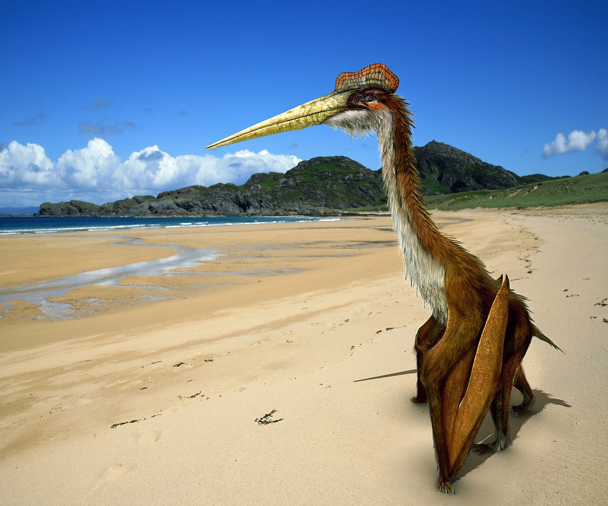

# quetzalcoatlus



A Qt-based 'proving-grounds' application to exercise interesting or re-usable parts of Qt, C++17, C++ build strategies (CMake/Makefile), deployment strategies on multiple platforms, including the Docker approach for cross-compilation.

This application is an attempt to preserve the random bits and pieces of advice collected over multiple projects into a (hopefully)cohesive project.

```
ADD MORE!
```

## Usage

### Build
```
git clone https://github.com/coolbreeze413/quetzalcoatlus.git
cd quetzalcoatlus
make
```

### Run
```
install/bin/quetzalcoatlus
```

## Attributions

The awesome quetzalcoatlus image used in the application is by Johnson Mortimer:  
http://johnson-mortimer.deviantart.com/art/Quetzalcoatlus-582934790  
CC BY 3.0  
https://commons.wikimedia.org/w/index.php?curid=49523137  
